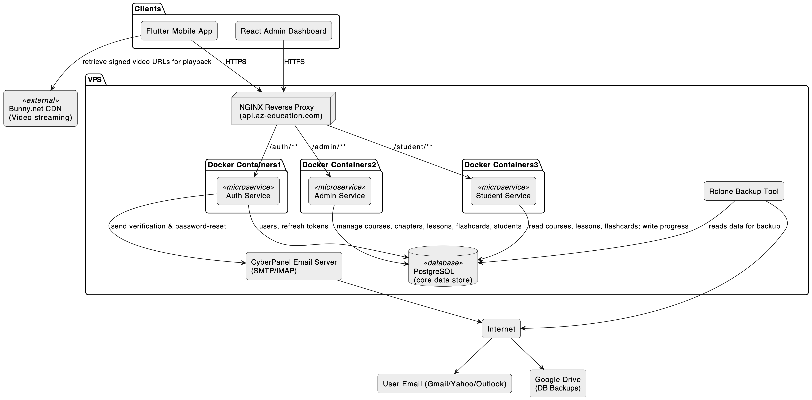
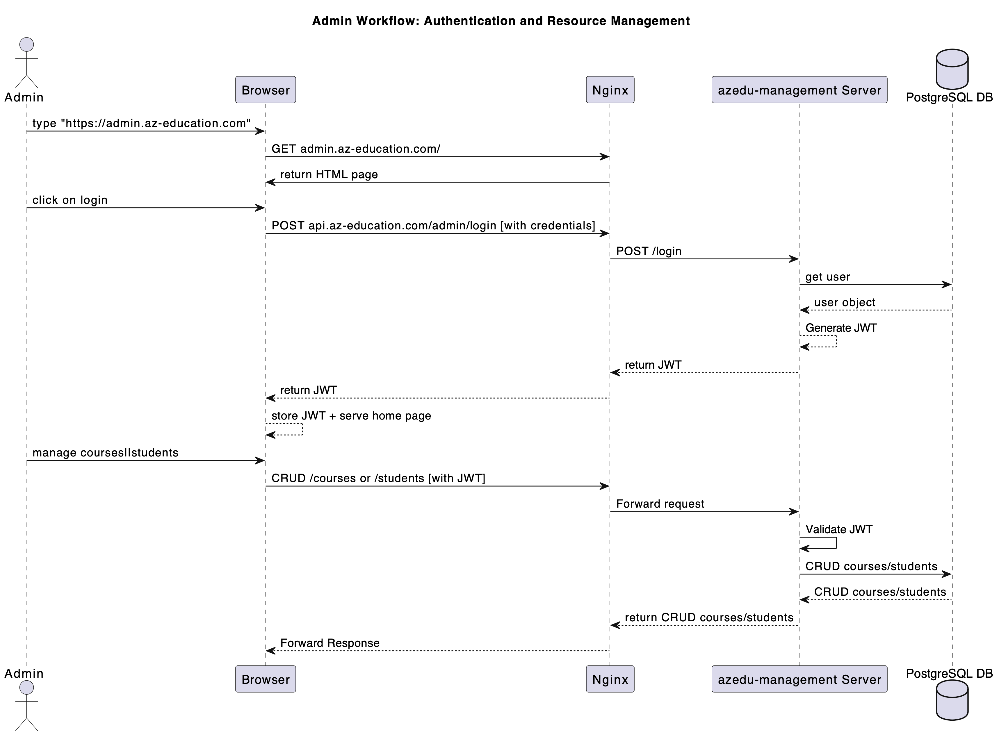
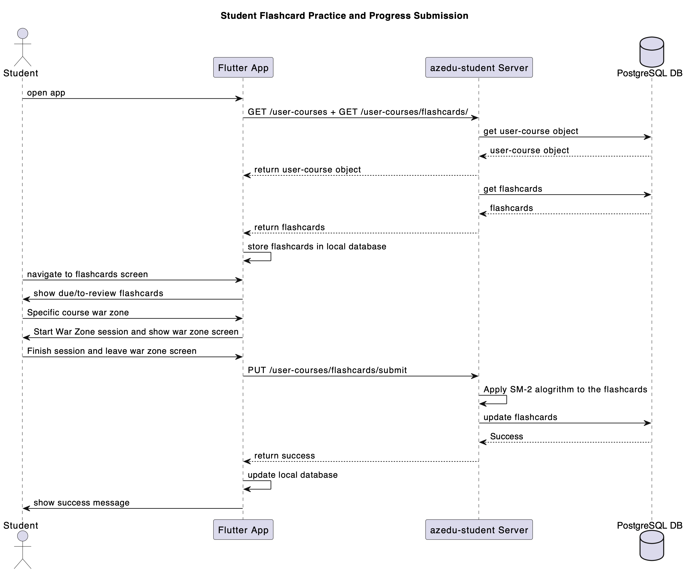
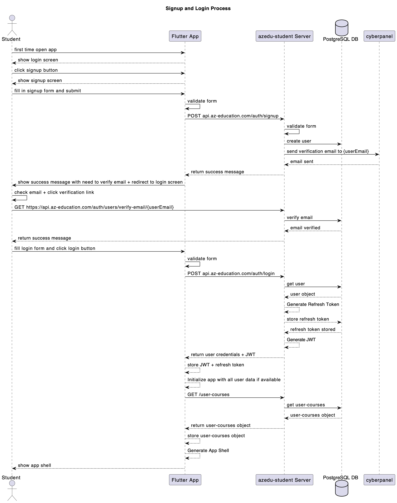
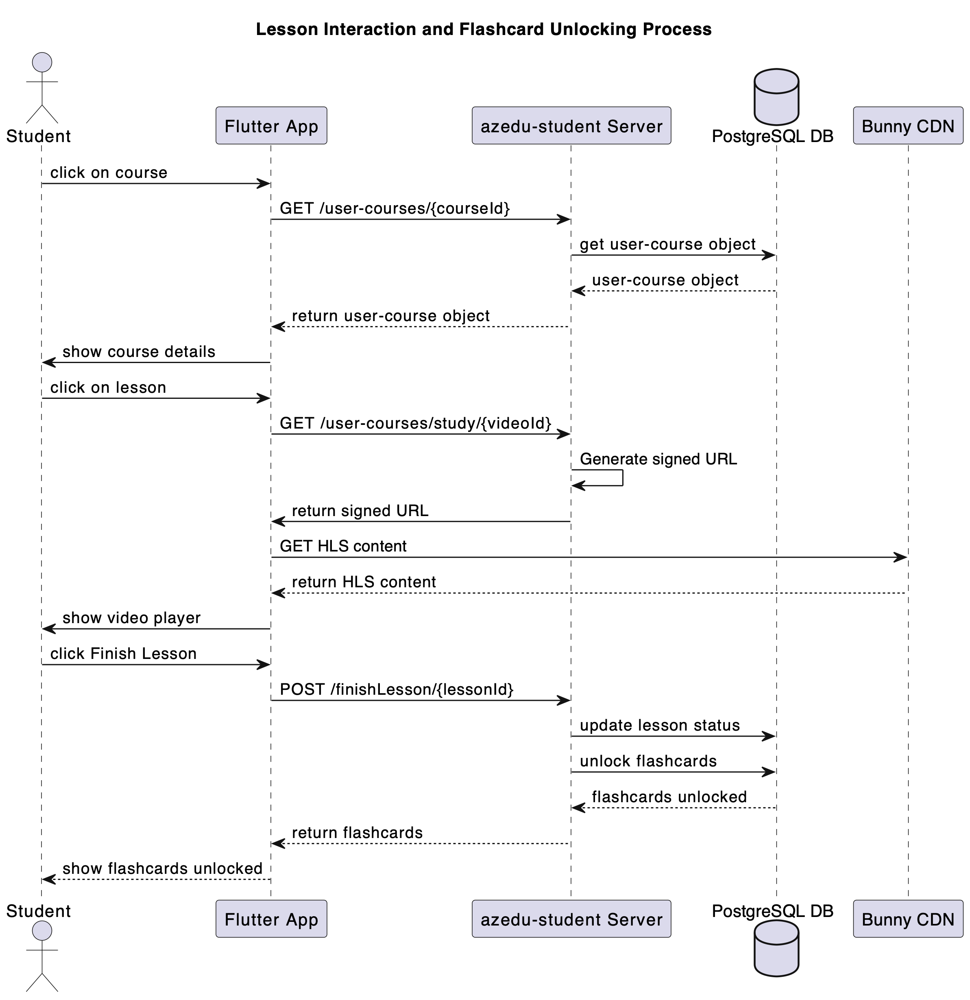

# AZ Education: Final Project Overview and Architecture

This document provides a comprehensive overview of the AZ Education project, detailing its architecture, key components, development journey, and the valuable insights gained throughout its creation.

## 1. Introduction

AZ Education is a mobile-first e-learning platform developed as a graduation project at Istanbul Okan University. Its primary objective is to deliver structured educational content through video streaming and interactive flashcards, supported by a robust backend and an intuitive administration panel. The project addresses the need for accessible and engaging digital learning solutions.

## 2. System Architecture and Components

AZ Education employs a microservices architecture, promoting modularity, scalability, and independent deployment of services.

### 2.1 Overall System Components Diagram

### 2.2 Core Microservices

* **Auth API (azedu-auth microservice):** Handles user registration, login, token management, and authentication processes.
* **Student API (azedu-student microservice):** Manages student-specific functionalities, including course Browse, subscription requests, and content access.
* **Admin API (azedu-management microservice):** Provides a comprehensive interface for administrators to manage courses, users, subscriptions, and platform settings.

### 2.3 Frontend Applications

* **Flutter Mobile App:** The primary user-facing application, providing an intuitive interface for students to access courses, videos, and homework.
    

* **React Admin Panel:** A web-based interface built for administrators to manage the educational content and user base efficiently.
    

### 2.4 Supporting Systems

* **Spaced Repetition Engine (SM-2 algorithm):** Integrated for optimizing flashcard homework delivery, ensuring effective knowledge retention.
    
* **Bunny.net Video Library:** Utilized for secure and adaptive video content delivery.
* **Postgres Database:** The primary data store for all application data, including user profiles, course information, and progress tracking.

## 3. Key Processes and User Flows

### 3.1 User Registration and Login

### 3.2 Lesson Cards Unlocking Flow

## 4. Technologies Used

* **Backend:** Go (Golang) for microservices
* **Frontend (Mobile):** Flutter
* **Frontend (Admin):** React Admin
* **Database:** PostgreSQL
* **Video Delivery:** Bunny.net
* **Load Testing:** K6
* **Spaced Repetition:** SM-2 Algorithm

## 5. Development Process and Learnings

The project development spanned approximately 5 months, following an iterative approach. Key learnings included:
* The importance of designing a scalable microservices architecture.
* Effective management of state and data flow in a mobile application.
* Implementing robust authentication and authorization mechanisms.
* Balancing technical requirements with user experience needs.
* The value of comprehensive testing (including acceptance tests) to validate functionality and performance.

## 6. Conclusion and Future Outlook

AZ Education stands as a robust and scalable e-learning solution. With its microservices architecture and modular design, it is well-prepared for future expansion, such as integrating online payments, advanced analytics, or additional educational features (as outlined in the SRS future plans).

The project also provided an invaluable learning experience in software design, system architecture, testing, and deployment, demonstrating how modern engineering practices can be applied to build impactful solutions. AZ Education represents a potential foundation for a real-world educational product.